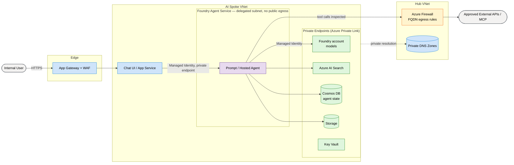

# From Azure Landing Zone to Secure AI: A Practical Guide to Enterprise Agentic Deployment (Part 1)

Every week, organizations announce new AI initiatives. A business stakeholder wants an internal chatbot. A product team wants a customer assistant. A knowledge management team wants to unlock information hidden across thousands of documents.

The first question is almost always *"which model should we use?"*

In an enterprise, that is the wrong place to start. And with **agents** it is not
just premature — it is dangerous. A chatbot that answers questions wrong is an
embarrassment. An *agent* that calls tools, reaches external systems, and acts on
your behalf with your permissions is a security boundary. If you get the
foundation wrong, you have not shipped a demo with a bug. You have deployed an
autonomous actor inside your network with credentials you never scoped.

This post follows the conversation that should happen *before* the first model is
deployed. Part 1 covers the whole arc end to end: the secure platform foundation
**and** the agent that runs on top of it.

## The cast

To keep it concrete, two people carry the story.

| Persona | Team | Owns |
| --- | --- | --- |
| **Maya** | Platform engineering | Landing zone, networking, identity, governance |
| **Sam** | AI engineering | The agent: tools, orchestration, model, evaluation, RAG pipeline |

They meet in the middle. Neither succeeds alone — and the thing that connects
them is a single handoff: a **managed identity** and a set of **private
endpoints** that Maya provisions and Sam's agent consumes.

## The scenario

A company already runs a mature Azure landing zone: management groups, Azure
Policy, hub-and-spoke networking, Entra ID, monitoring, cost controls. One
morning a request lands:

> "We want an AI assistant that can answer questions about our internal docs —
> and eventually take actions, like filing a ticket or updating a record."

Three teams hear three different things, and all three are right. The business
sees an AI project. Maya sees a new workload. Sam sees an **agent**: a model,
plus tools, plus an orchestration loop that decides which tool to call next.

That word — *agent* — is what raises the stakes.

## Why agents raise the bar

Traditional workloads are deterministic: same input, same path, same output.
Microsoft's own Well-Architected guidance is blunt that AI workloads are
different — they exhibit **non-deterministic behavior**, which makes them more
adaptable but much harder to reason about and contain.[1](https://learn.microsoft.com/en-us/azure/well-architected/ai/) Three properties
turn an "AI feature" into a security problem you have to design for:

- **It calls tools.** An agent does not just emit text; it invokes functions,
  queries indexes, hits APIs, and increasingly talks to **MCP servers**. Every
  tool is a new outbound path and a new privilege.
- **It consumes untrusted content.** The documents it retrieves and the web
  pages it reads can contain instructions. Prompt injection is not a fringe
  concern; it is the default attack surface of any retrieval-grounded agent.
- **It acts.** The moment an agent can write — file a ticket, send a message,
  change a record — its identity and its permissions *are* the blast radius.

So Maya does not start with a model. She starts with the same four questions she
would ask of any workload, and Microsoft's Cloud Adoption Framework gives her the
checklist to do it: get the environment **AI Ready**, then **Secure** and
**Govern** it before anything intelligent is deployed.[2](https://learn.microsoft.com/en-us/azure/cloud-adoption-framework/scenarios/ai/)

## Part A — The platform foundation (Maya)

### Where will this workload live?

The first decision is topology: shared application subscription, a dedicated AI
subscription, or a full AI landing zone. Maya's default is **extend, don't
rebuild** — a dedicated AI subscription inside the existing landing zone, peered
to the hub. Blast radius stays contained, cost attribution stays clean, and she
avoids inventing a parallel architecture. Two things push toward a fuller AI
landing zone: **regulated or highly sensitive data**, and **multiple independent
AI teams** that each need isolation.

### Map the data *and the action* flow

Before provisioning anything, Maya and Sam map the flow together. For a plain RAG
chatbot you map data: where it originates, how it is ingested, where sensitive
content sits, who reads the output. For an **agent** you map one more thing:
**actions**. What can the agent *do*, not just see? Which tools can write? Which
reach outside the boundary? That map drives every control that follows.

### Zero Trust = private connectivity *and* controlled egress

Most AI tutorials expose services publicly because it is easy. Enterprises rarely
have that luxury. The principle is **Zero Trust**: identity is the security
boundary, not network location. The implementation is **private connectivity** —
and for agents it has two halves that tutorials almost always miss.

**Inbound and east-west — private endpoints.** The enterprise baseline
architecture for a Foundry chat app puts *every* PaaS dependency behind Azure
Private Link: the Foundry account (where the models live), AI Search, Storage,
Cosmos DB, and the Agent Service itself, all reachable only over private
endpoints with public network access disabled and private DNS zones for internal
name resolution.[3](https://learn.microsoft.com/en-us/azure/architecture/ai-ml/architecture/baseline-azure-ai-foundry-chat) Traffic stays on the Azure backbone; it never touches the
public internet.

**Outbound — this is the agentic part.** A RAG app mostly *receives* requests.
An agent *makes* them: every tool call and external lookup is outbound traffic.
The baseline routes all of it through **Azure Firewall**, which enforces
**FQDN-based egress rules** so the agent can only reach approved
destinations.[3](https://learn.microsoft.com/en-us/azure/architecture/ai-ml/architecture/baseline-azure-ai-foundry-chat) Foundry Agent Service's **Standard setup with private
networking** makes this the default: you bring your own VNet and a delegated
subnet, agent compute is injected into it, and there is **no public
egress**.[4](https://learn.microsoft.com/en-us/azure/ai-foundry/agents/how-to/virtual-networks) That single control — egress allow-listing — is the difference
between "an agent that can call the one API it needs" and "an agent that can be
talked into exfiltrating your data to anywhere."

### Identity before infrastructure

This is the heart of the argument, and it is stronger for agents than for any
other workload. Maya provisions identity *before* a single AI service exists:

- **Managed identities replace secrets.** No keys in app settings, no connection
  strings in config. The agent authenticates to Foundry with its managed
  identity over a private endpoint.[3](https://learn.microsoft.com/en-us/azure/architecture/ai-ml/architecture/baseline-azure-ai-foundry-chat)
- **Least privilege for *actions*, not just reads.** A read-only RAG agent gets
  `Cognitive Services OpenAI User` (which grants exactly one thing that matters:
  the right to make inference calls with Entra ID — no key access, no
  deployment rights),[7](https://learn.microsoft.com/en-us/azure/ai-services/openai/how-to/role-based-access-control) plus `Search Index Data Reader` and
  `Storage Blob Data Reader`. An agent that *writes* gets a separate, explicitly
  scoped role for each action — and nothing more.
- **One identity per agent, not one for the fleet.** When several agents share an
  identity you lose the ability to attribute an action or revoke one agent's
  access. Separate identities keep blast radius and audit trails per agent.

These decisions are trivially easy now and painful after production adoption.

### Untrusted content is a boundary too

Network isolation does not stop prompt injection, because the malicious
instruction arrives *inside* legitimate data. The platform-level answer is
**Azure AI Content Safety Prompt Shields**, a dedicated API that screens user
prompts and grounding documents for adversarial input before the model acts on
it.[6](https://learn.microsoft.com/en-us/azure/ai-services/content-safety/concepts/jailbreak-detection) Foundry Agent Service can enforce content safety as part of the agent
runtime rather than something Sam bolts on later.[3](https://learn.microsoft.com/en-us/azure/architecture/ai-ml/architecture/baseline-azure-ai-foundry-chat) Maya treats this as part
of the foundation, not an application detail.

### Governance, cost, and observability

Agent consumption scales faster than teams expect — a single misbehaving loop can
burn tokens all night. Maya sets guardrails early: resource tagging, cost
allocation, **budget alerts**, quotas, and Azure Policy to *deny* public network
access on the AI services. She also wires **diagnostics and tracing** from day
one, because a non-deterministic system you cannot observe is a system you cannot
debug or defend.

### What goes wrong if you skip this

None of these are exotic. They are the *default* outcome when the model
conversation happens first:

- A public model endpoint, open to the internet.
- An API key pasted into config and later leaked in a repo.
- An agent with unrestricted egress, turned into an exfiltration tool by a
  poisoned document.
- Token spend with no budget alert, discovered on the monthly invoice.

### The handoff contract

At the end of Part A, nothing intelligent is deployed. No prompts, no embeddings,
no model. Yet the decisions that matter are made, and Maya hands Sam a concrete
contract:

1. A **managed identity** with least-privilege roles (read-only today, scoped
   write roles when the agent earns them).
2. A set of **private endpoints** behind which every AI service lives.
3. A **VNet with a delegated agent subnet** and **firewall egress rules** that
   say exactly where the agent may reach.
4. **Prompt Shields, content safety, budgets, and tracing**, on by default.

Only now is the environment ready for an agent.

## Part B — The agent on top (Sam)

With the foundation in place, Sam builds — reaching back to the handoff at every
step. Nothing below reintroduces a public path or a secret.

### Documents become a tool, not the whole app

The requirement — "answer questions about company information" — still needs
unstructured content turned into something a model can reason over: collect,
chunk, embed, index. This is Retrieval-Augmented Generation. But for an agent,
RAG is **one tool among several**, exposed through the Agent Service's search
tooling, not the entire application.[3](https://learn.microsoft.com/en-us/azure/architecture/ai-ml/architecture/baseline-azure-ai-foundry-chat) The ingestion job writes to Storage and
AI Search **over their private endpoints**, authenticated by the managed identity
— the data never leaves the boundary.

### Designing the agent

Sam defines the agent's instructions, its model, and its **connected tools** —
the AI Search tool for grounding, maybe a web-search tool, maybe a custom API
tool for actions. Two design choices matter most:

- **Where state lives.** Foundry's standard setup keeps conversation history and
  agent metadata in **your own Azure resources** — Cosmos DB for threads and
  agent definitions, Storage for files, AI Search for vectors — so agent state
  stays in your tenant and under your governance, not a Microsoft-managed
  multitenant store.[5](https://learn.microsoft.com/en-us/azure/ai-foundry/agents/concepts/standard-agent-setup) (If you have used only basic setups, this is the part
  people forget: standard setup means *you* bring the Cosmos DB account.)
- **How much autonomy.** For read-only Q&A, a declarative **prompt agent** hosted
  by Agent Service is enough. The moment the agent takes consequential actions,
  Sam wants explicit orchestration and **human-in-the-loop** approval — which is
  exactly when Microsoft's guidance points you from a prompt agent to a
  code-driven **hosted agent** built on a framework like the **Microsoft Agent
  Framework** or Semantic Kernel.[3](https://learn.microsoft.com/en-us/azure/architecture/ai-ml/architecture/baseline-azure-ai-foundry-chat) Deterministic control over the action
  path is a feature, not a regression.

### Now the model question matters

Only here does *"which model?"* finally earn an answer — judged on accuracy,
latency, cost, context window, and data sensitivity. Both the models and the
agent come from **Microsoft Foundry**: the model is deployed into the **private
Foundry account** Maya already stood up, and Foundry Agent Service runs the agent
in its project. "The model" is not limited to Azure OpenAI either — the Foundry
catalog also sells non-OpenAI models (Grok, Llama, DeepSeek, MAI-DS-R1), and
Azure OpenAI models are the ones that "power agents in Foundry Agent
Service."[8](https://learn.microsoft.com/en-us/azure/ai-foundry/agents/concepts/model-region-support) It is one component in a system, not the center of it.

### Evaluate before production

A working demo is not a production system. Before shipping, Sam evaluates
response quality, **grounding accuracy**, hallucination rate, **prompt-injection
resistance**, safety behavior, latency, and cost. The bar is confidence, not a
green checkmark on a happy-path demo.

### Bringing the two worlds together

When the agent finally calls its model and tools, it does so **through the managed
identity, over the private endpoints, with egress constrained by the firewall
rules Maya wrote**. That sentence is the payoff of the whole post: the platform
foundation is not background scenery. It is what the agent stands on, and what
keeps an autonomous actor from becoming an incident.

## Architecture at a glance

Here is what the two halves look like together — inbound through a WAF, every
dependency behind a private endpoint, and *outbound* tool calls forced through
the firewall.

## Try it yourself

The companion lab reproduces this end to end — foundation first, agent second —
using Azure CLI and Bicep. It is built so the security controls in this post are
real, not narrated: public access disabled, private endpoints, a delegated agent
subnet, firewall egress rules, least-privilege RBAC, and the BYO state resources
the standard agent setup requires. See
[`samples/landing-zone-to-secure-ai/`](../samples/landing-zone-to-secure-ai/) for
the walkthrough, the deployable Bicep in
[`samples/landing-zone-to-secure-ai/infra/`](../samples/landing-zone-to-secure-ai/infra/),
and an editable version of the diagram above in
[`landing-zone-to-secure-ai-part-1.excalidraw`](./landing-zone-to-secure-ai-part-1.excalidraw).

> Azure AI product names, model availability per region, private DNS zone
> namespaces, and RBAC role names change frequently — the Foundry roles were
> renamed recently, for example.[4](https://learn.microsoft.com/en-us/azure/ai-foundry/agents/how-to/virtual-networks) Verify current details in Microsoft Learn
> before you deploy.

## What Part 2 covers

Part 1 ended the moment the agent answered its first question safely. Part 2
takes the agent into day-two reality: multi-agent orchestration and agent-to-agent
calls, continuous evaluation and drift detection in production, action approval
workflows, and the observability you need to trust a non-deterministic system at
scale. The foundation Maya built is what makes all of it possible.

---

The story of an enterprise AI project does not begin with a model deployment. It begins
with architecture, identity, egress, and governance. Only after those
conversations happen does the first model get deployed — and by then the
organization is ready to use it properly.

## Sources

1. [Azure Well-Architected Framework — AI workloads (non-deterministic behavior)](https://learn.microsoft.com/en-us/azure/well-architected/ai/)
2. [Cloud Adoption Framework — AI adoption (AI Ready, Secure AI, Govern AI checklists)](https://learn.microsoft.com/en-us/azure/cloud-adoption-framework/scenarios/ai/)
3. [Azure Architecture Center — Baseline Azure AI Foundry chat reference architecture (private endpoints, Azure Firewall egress, managed identity, prompt vs. hosted agents, content safety)](https://learn.microsoft.com/en-us/azure/architecture/ai-ml/architecture/baseline-azure-ai-foundry-chat)
4. [Azure AI Foundry — Use a virtual network with the Agent Service (Standard setup with private networking; Foundry RBAC role rename)](https://learn.microsoft.com/en-us/azure/ai-foundry/agents/how-to/virtual-networks)
5. [Azure AI Foundry — Standard agent setup (BYO Cosmos DB, Storage, AI Search, Key Vault for agent state)](https://learn.microsoft.com/en-us/azure/ai-foundry/agents/concepts/standard-agent-setup)
6. [Azure AI Content Safety — Prompt Shields (adversarial prompt / document detection)](https://learn.microsoft.com/en-us/azure/ai-services/content-safety/concepts/jailbreak-detection)
7. [Azure OpenAI — Role-based access control (Cognitive Services OpenAI User: inference via Entra ID, no key access)](https://learn.microsoft.com/en-us/azure/ai-services/openai/how-to/role-based-access-control)
8. [Microsoft Foundry — Models supported in Foundry Agent Service (Azure OpenAI models power agents; non-OpenAI Foundry Models sold by Azure: Grok, Llama, DeepSeek, MAI-DS-R1)](https://learn.microsoft.com/en-us/azure/ai-foundry/agents/concepts/model-region-support)
